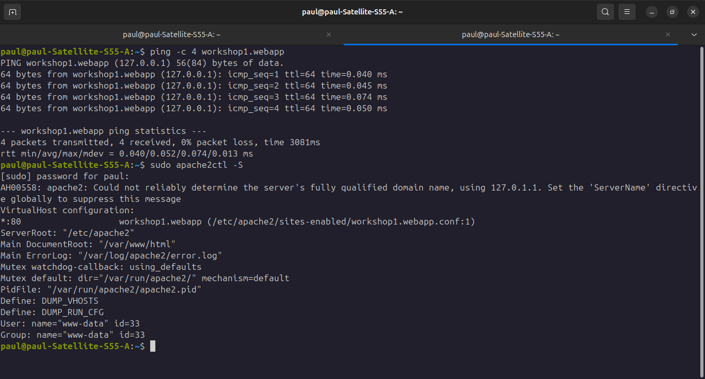
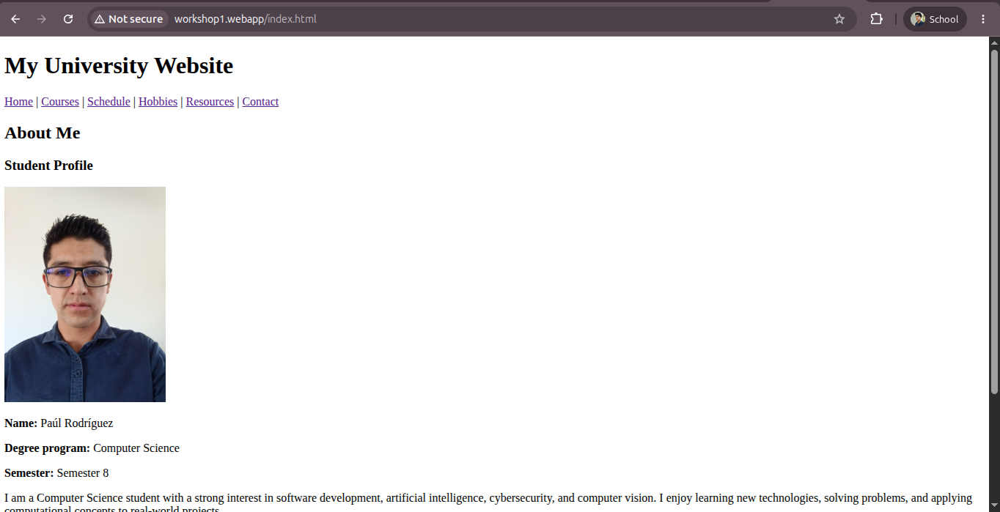
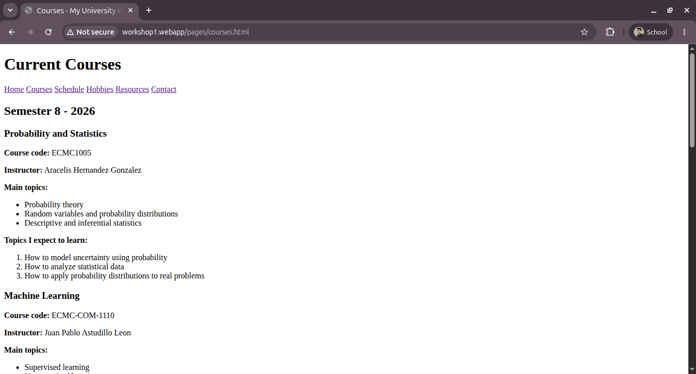
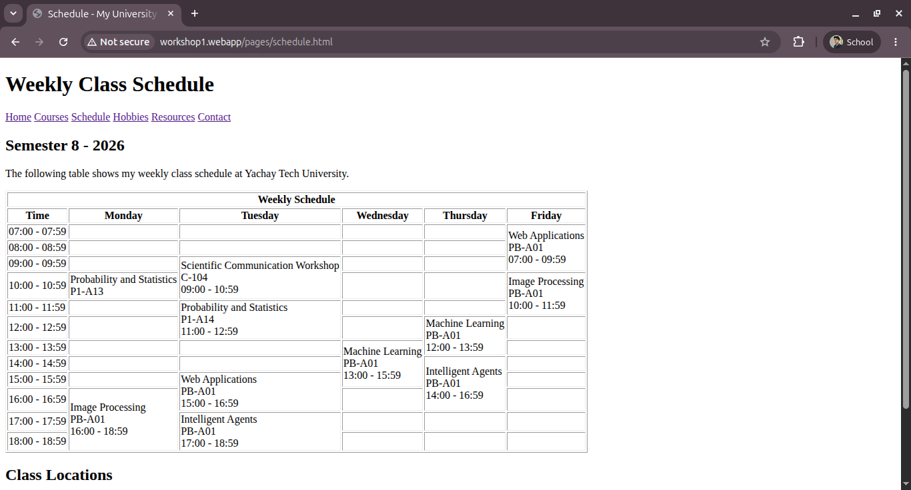
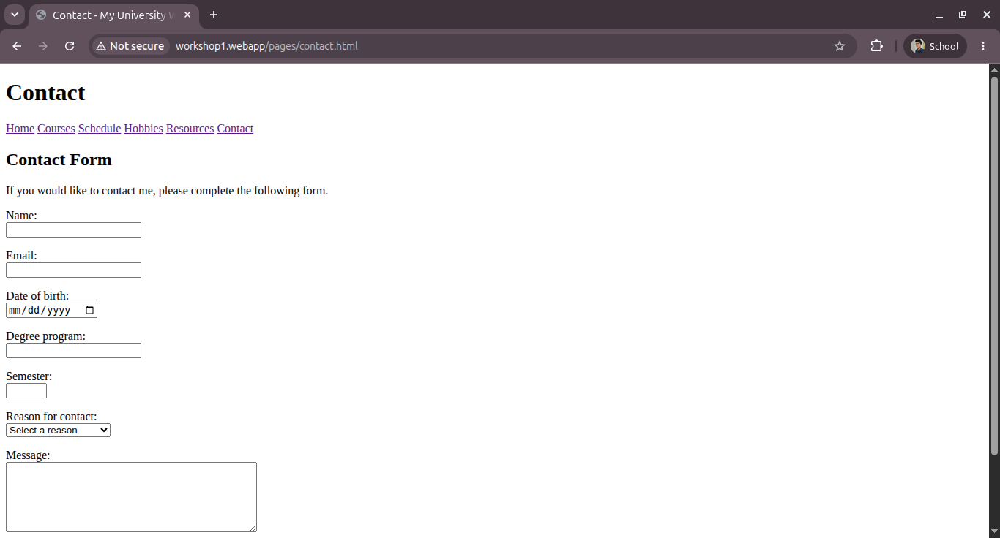
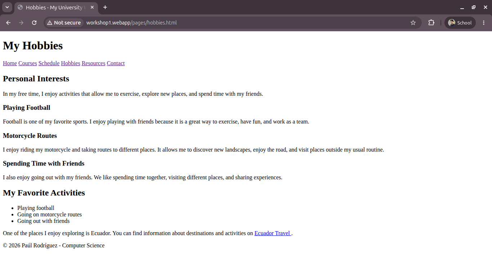
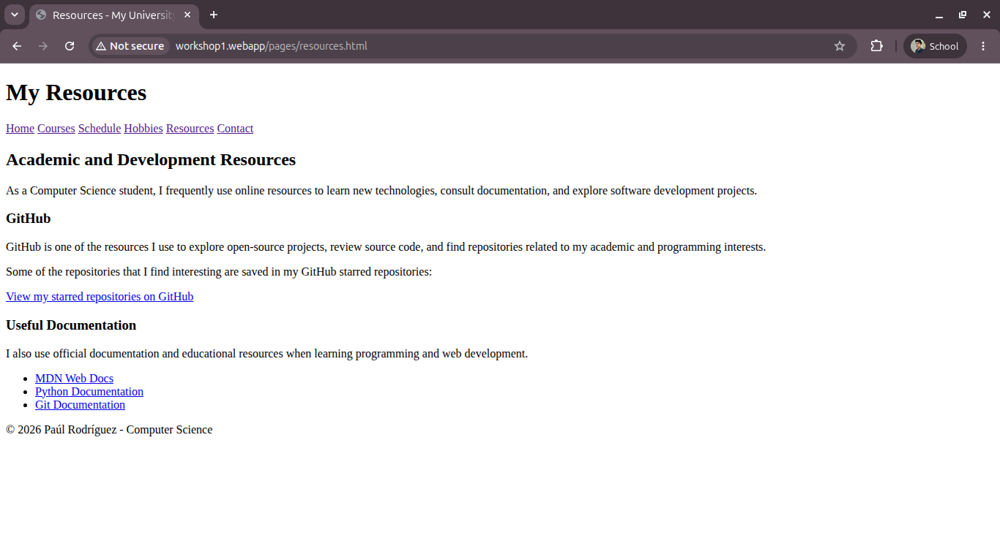

# Web Applications — Workshop 1

## Website (Only HTML)

**Student:** Paúl Rodríguez
**Degree Program:** Computer Science
**Semester:** 8
**University:** Yachay Tech University
**Course:** Web Applications
**Instructor:** Francisco Javier Hidrobo Torres
**Academic Period:** Semester II 2026

---

## 1. Project Description

This project consists of a personal university website developed using **HTML5 only**.

The objective of the workshop is to practice the fundamental structure of HTML documents and the use of semantic HTML elements, navigation, lists, links, images, tables, and forms.

The website consists of multiple interconnected pages containing academic and personal information.

No CSS or JavaScript was used in this workshop.

---

## 2. Local Web Server Configuration

The project was configured to run locally using **Apache HTTP Server**.

The local domain:

```text
http://workshop1.webapp
```

was mapped to localhost by adding the following entry to the operating system's `hosts` file:

```text
127.0.0.1 workshop1.webapp
```

The configuration was verified using:

```bash
ping workshop1.webapp
```

An Apache Virtual Host was also configured to serve the `my-site` directory when accessing `workshop1.webapp`.

### Evidence



---

## 3. Project Structure

The project is organized as follows:

```text
my-site/
│
├── index.html
├── README.md
│
├── images/
│   └── profile.png
│
├── evidence/
│   ├── server.png
│   ├── home.png
│   ├── courses.png
│   ├── schedule.png
│   ├── contact.png
│   ├── hobbies.png
│   └── resources.png
│
└── pages/
    ├── courses.html
    ├── schedule.html
    ├── contact.html
    ├── hobbies.html
    └── resources.html
```

---

## 4. Home Page

The main page is implemented in `index.html`.

It uses the HTML5 document structure and semantic elements such as:

* `<header>`
* `<nav>`
* `<main>`
* `<section>`
* `<article>`
* `<footer>`

The page contains my name, degree program, current semester, a brief personal description, a profile image, and a list of academic interests.

A navigation menu connects the home page with all the other pages of the website.

### Evidence



---

## 5. Courses

The `courses.html` page contains information about the courses I am currently taking during Semester 8:

* Probability and Statistics
* Machine Learning
* Intelligent Agents
* Web Applications
* Image Processing
* Scientific Communication Workshop

For each course, the page includes:

* Course name and code
* Instructor
* Main topics
* Three topics that I expect to learn

The page uses headings, paragraphs, ordered lists, unordered lists, and external links.

### Evidence



---

## 6. Weekly Schedule

The `schedule.html` page contains my weekly class schedule at Yachay Tech University.

The schedule was implemented using an HTML `<table>` with the days of the week, class hours, course names, and classrooms.

The attributes `rowspan` and `colspan` are used to represent classes that occupy multiple hours and to organize the table header.

The `border` attribute is used to make the table visible for this workshop. Visual presentation can later be handled using CSS.

### Evidence



---

## 7. Contact Form

The `contact.html` page contains an HTML form designed to practice different form elements and input types.

The form contains:

* Name
* Email address
* Date of birth
* Degree program
* Semester
* Reason for contact
* Message
* Acceptance checkbox
* Submit button
* Reset button

Different HTML elements and input types are used, including:

```html
<input type="text">
<input type="email">
<input type="date">
<input type="number">
<input type="checkbox">
<select>
<textarea>
```

The form does **not use a backend or database**. Therefore, the information entered into the form is not stored. Its purpose is to demonstrate how HTML forms work.

### Evidence



---

## 8. Hobbies

The `hobbies.html` page contains information about some of my personal interests:

* Playing football
* Going on motorcycle trips
* Spending time with friends

The information is organized using semantic HTML elements, headings, paragraphs, and lists.

### Evidence



---

## 9. Resources

The `resources.html` page contains useful resources related to Computer Science and software development.

Resources include:

* GitHub
* MDN Web Docs
* Python Documentation
* Git Documentation

The page also provides access to my starred GitHub repositories, where I save projects and repositories related to my academic and programming interests.

External links use:

```html
target="_blank"
```

to open the resources in a new browser tab.

### Evidence



---

## 10. Website Navigation

All pages are interconnected through a navigation menu:

```text
Home | Courses | Schedule | Hobbies | Resources | Contact
```

Relative paths are used to navigate between `index.html` and the pages located inside the `pages/` directory.

For example, from the home page:

```html
<a href="pages/courses.html">Courses</a>
```

and from a page inside `pages/`:

```html
<a href="../index.html">Home</a>
```

---

## 11. Technologies Used

* HTML5
* Apache HTTP Server
* Git
* GitHub

---

## 12. Repository

The complete source code for Workshop 1 is available in this repository:

**GitHub:**
https://github.com/Steven735-star/APLICACIONES-WEB-/tree/main

---

## Author

**Paúl Rodríguez**
Computer Science — Semester 8
Yachay Tech University
2026
